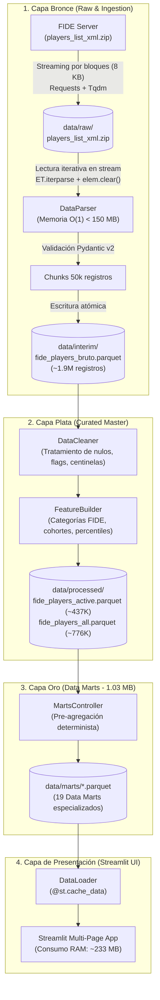

# ♟️ Kepler ChessAnalytics

> **Plataforma de Inteligencia de Datos & Dashboard Analítico de Alto Rendimiento sobre el Padrón Oficial de la FIDE (~1.9 Millones de Jugadores).**

[](https://www.python.org/downloads/)
[](https://streamlit.io/)
[](#2-arquitectura-del-sistema-medallion-lakehouse)
[](https://parquet.apache.org/)
[](#6-suite-de-pruebas-automatizadas)
[](#4-optimizaciones-de-alto-rendimiento-sprints-14)

---

## 1. Visión General del Proyecto

Cada mes, la **Federación Internacional de Ajedrez (FIDE)** publica el padrón oficial de jugadores federados en el mundo: un archivo XML monolítico de casi **2 millones de registros** que supera 1.8 GB sin comprimir. La gran mayoría de análisis existentes se limitan a muestras reducidas o dependen de procesos manuales lentos que saturan la memoria del servidor.

**Kepler ChessAnalytics** resuelve este desafío construyendo una solución *end-to-end* de nivel productivo:
1. **Ingesta en Streaming de Memoria Constante ($O(1)$):** Procesa el XML crudo en fragmentos de red con consumo de memoria menor a 150 MB sin volcar gigabytes de texto plano a disco.
2. **Arquitectura Medallion Lakehouse (`Bronze -> Silver -> Gold`):** Canaliza las etapas de limpieza, validación estricta con Pydantic v2, enriquecimiento de variables y generación determinista de **Data Marts analíticos**.
3. **Frontend Reactivo y Ligero en Streamlit:** Dashboard multipágina desacoplado del procesamiento pesado que opera consumiendo únicamente **~233 MB de RAM máxima**, lo que permite desplegarlo de forma completamente gratuita en servicios cloud de recursos limitados (como Streamlit Community Cloud o Render).

---

## 2. Arquitectura del Sistema (Medallion Lakehouse)

El sistema opera bajo un principio rector estricto:
> *"Los Notebooks exploran e investigan; el Motor ETL (`src/`) ejecuta y produce; la Aplicación Web (`app/`) visualiza."*



### Capas de Almacenamiento y Gobernanza

| Capa | Directorio | Descripción | Formato / Tamaño |
| :--- | :--- | :--- | :---: |
| **Bronce (Raw)** | `data/raw/` | Archivo ZIP original descargado de la FIDE. Inmutable. | `.zip` (~58 MB) |
| **Plata (Interim)** | `data/interim/` | Snapshot bruto validado por modelos Pydantic. | `.parquet` (~46 MB) |
| **Master (Processed)** | `data/processed/` | Padrón curado, con tipos corregidos y segmentado (Total vs. Activo). | `.parquet` (~67 MB) |
| **Oro (Marts)** | `data/marts/` | **19 Data Marts agregados**, listos para servir consultas a la UI en $<5$ ms. | `.parquet` (**1.03 MB**) |

---

## 3. Ventanas de Descubrimiento (Aplicación Web)

La aplicación web (`app/main.py`) cuenta con 6 módulos interactivos organizados temáticamente:

```text
app/pages/
├── 00_inicio.py               # Portada, resumen metodológico y cifras hero del padrón mundial
├── 01_panorama_global.py      # Concentración federativa, mapa coroplético Robinson y tablas de cuota
├── 02_distribucion_elo.py     # Densidades KDE por ritmo, percentiles y estructura de títulos
├── 03_demografia_genero.py    # Brecha de género (90/10), pirámide etaria y rankings de paridad
├── 04_cohortes_juveniles.py   # Canteras formativas (Sub-8 a Sub-20) y curvas biológicas de Elo
└── 05_venezuela.py            # Radiografía nacional, buscador reactivo y cuadro de honor
```

* **00 — Inicio:** KPIs globales del padrón (Total de jugadores, jugadores activos, países representados).
* **01 — Panorama Global:** Top 15 de federaciones por volumen de jugadores (India, Rusia, Francia, España liderando) con proyección cartográfica Robinson y barras de progreso nativas.
* **02 — Distribución de Elo:** Análisis multimodal comparando Clásico, Rápido y Blitz; histograma precalculado en intervalos de 20 puntos y distribución piramidal de títulos internacionales (GM, IM, FM, CM).
* **03 — Demografía y Género:** Exploración de la brecha estructural de participación femenina (~10.8 % mundial), pirámide etaria quinquenal interactiva y federaciones con mayor paridad relativa.
* **04 — Cohortes Juveniles:** Análisis del semillero deportivo en categorías Sub-8 hasta Sub-20, curvas de maduración de rating y matrices de canteras mundiales.
* **05 — Venezuela:** Estudio de caso nacional sobre los 3.055 jugadores federados en Venezuela, desglose de maestros titulados y cuadro de honor interactivo con filtros independientes.

---

## 4. Estructura del Repositorio

```text
Kepler-ChessAnalitic/
├── app/                         # Frontend Streamlit desacoplado
│   ├── assets/                  # Recursos estáticos
│   ├── components/              # Componentes de UI (charts.py, kpis.py, theme.py)
│   ├── pages/                   # Páginas multi-página (00 a 05)
│   ├── service/                 # Servicios DAL consumidores de Capa Oro
│   └── main.py                  # Entrypoint de Streamlit
├── data/
│   ├── raw/                     # [Bronce] ZIP oficial FIDE
│   ├── interim/                 # [Plata] Parquet bruto tipado
│   ├── processed/               # [Master] Datasets limpios
│   └── marts/                   # [Oro] 19 Data Marts (< 1.1 MB total)
├── docs/                        # Guías de arquitectura, optimización y migración
├── notebooks/                   # Entorno de exploración e hipótesis (EDA)
├── research/                    # Bitácoras de ingeniería, diagnósticos y benchmarks
├── src/                         # Motor ETL Medallion Lakehouse
│   ├── config/                  # Constantes y variables de configuración
│   ├── controllers/             # Orquestadores de procesamiento y marts
│   ├── ingestion/               # Downloader, Streaming Parser y Writer
│   ├── marts/                   # Constructores especializados de Capa Oro
│   ├── models/                  # Esquemas y validadores Pydantic
│   ├── processing/              # Limpiador y constructor de features
│   └── main.py                  # CLI unificada de ejecución ETL
├── tests/                       # Suite automatizada con pytest
├── requirements.txt             # Dependencias optimizadas para despliegue Cloud
├── pyproject.toml               # Configuración del paquete y herramientas
└── README.md                    # Este documento
```

---

## 5. Suite de Pruebas Automatizadas

El proyecto cuenta con pruebas de integración y validación que cubren el pipeline de datos, los servicios analíticos y los contratos visuales:

```bash
# Ejecutar todas las pruebas
pytest
```

```text
tests/test_processing.py ..                                       [ 25%]
tests/test_services.py ......                                     [100%]
============================== 8 passed in 0.62s ===============================
```

---

## 6. Instalación y Uso Local

### Requisitos
* **Python:** `>= 3.10`
* **Git**

### 1. Clonar el repositorio y preparar entorno
```bash
git clone https://github.com/Entropy-v0/Kepler-ChessAnalytics.git
cd Kepler-ChessAnalytics

python3 -m venv .venv
source .venv/bin/activate   # En Windows: .venv\Scripts\activate
pip install -r requirements.txt
```

### 2. Ejecutar la Aplicación Web (Streamlit)
```bash
streamlit run app/main.py
```
*La aplicación abrirá en `http://localhost:8501` leyendo directamente la Capa Oro (`data/marts/`).*

### 3. Ejecutar el Pipeline ETL (Opcional)
Para reconstruir los datos desde el archivo oficial de la FIDE:
```bash
# Ejecutar todo el flujo (Ingesta -> Limpieza -> Features -> Data Marts)
python src/main.py --step all

# O ejecutar pasos específicos:
python src/main.py --step marts       # Regenerar únicamente la Capa Oro
python src/main.py --step clean       # Re-limpiar datos intermedios
```

---

## 7. Hoja de Ruta Futura (Roadmap)

- [x] Pipeline de streaming $O(1)$ para el padrón FIDE XML.
- [x] Arquitectura Medallion Lakehouse completa (`Bronze -> Silver -> Gold`).
- [x] Dashboard analítico interactivo de 6 páginas con Streamlit y Plotly.
- [x] Reducción del payload WebSocket del histograma a 7.3 KB (-99.75 %).
- [x] Aislamiento reactivo vía `@st.fragment` y caching estático `@st.cache_data`.
- [ ] Particionado temporal por snapshots mensuales (`year=YYYY/month=MM/`).
- [ ] Motor de Captura de Cambios (CDC) para deltas mensuales ($\Delta$ Elo, ascensos de título).
- [ ] API REST en FastAPI para consultar estadísticas de jugadores federados en tiempo real.

---

## 8.  Créditos

* **Datos Oficiales:** Padrón publicado por la [Federación Internacional de Ajedrez (FIDE)](https://ratings.fide.com/).

