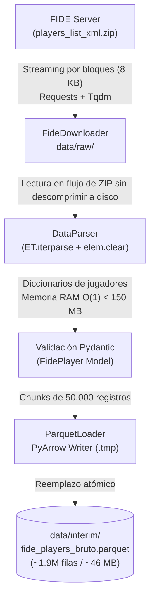

# Kepler ChessAnalitic

> **Herramienta y pipeline de análisis de datos para el padrón oficial de jugadores de ajedrez de la FIDE.**

Este proyecto tiene como objetivo procesar, estructurar y analizar las listas oficiales de jugadores publicadas periódicamente por la **Federación Internacional de Ajedrez (FIDE)** (~2 millones de registros). 

A diferencia de análisis superficiales basados en tablas estáticas preprocesadas, **Kepler ChessAnalitic** aborda el ciclo completo: desde la ingesta en *streaming* de bajo consumo de memoria RAM ($O(1)$) del XML crudo, hasta la exploración estadística profunda de demografía, ritmos de juego (Clásico, Rápido, Blitz) y distribución de títulos federativos.

---

## 1. Estado Actual del Proyecto

Para mantener una visión pragmática y libre de sobredimensionamiento ("sin humo"), el estado actual de los componentes del repositorio se resume en la siguiente matriz:

| Componente | Estado | Descripción técnica real |
| :--- | :---: | :--- |
| **Ingesta Streaming (`src/ingestion`)** | **Operativo** | Descarga en bloques por red y parseo iterativo con `iterparse` + `elem.clear()` de bajo consumo de RAM (< 150 MB). Escritura columnar en chunks de 50.000 filas hacia formato Parquet con reemplazo atómico. |
| **Validación de Datos (`src/models`)** | **Operativo** | Modelo `FidePlayer` en Pydantic v2 que sanea strings vacíos a `None` y garantiza tipado estricto en identificadores, ratings y años de nacimiento. |
| **Capa de Datos (`data/`)** | **Operativo** | Esquema estructurado en `raw/` (ZIP original), `interim/` (bruto ~1.9M registros) y `processed/` (datasets limpios: global y activos). |
| **Limpieza y Curaduría (`notebooks/00`)** | **Operativo** | Depuración de nulos en títulos (`nt`), imputación de estados de actividad (`flag`), tratamiento de anomalías en año de nacimiento (`>= 1920`) y cálculo de variable `edad`. |
| **Exploración General (`notebooks/01`)** | **Operativo** | Densidad de ratings (KDE comparativo), concentración por federaciones (Top 15 liderado por IND, RUS, FRA, ESP) y tablas cruzadas de cuota mundial de títulos. |
| **Análisis Demográfico (`notebooks/02`)** | **Operativo** | Caracterización de brecha de género (~90% M / ~10% F), análisis por cohortes juveniles (Sub-8 a Sub-20) y cruce federativo. |
| **Módulo Estadístico (`src/analytics`)** | **En desarrollo** | Prototipo inicial de `UnivariateAnalyzer` con métricas de tendencia central, dispersión y forma (curtosis y asimetría). Métodos de normalidad y outliers pendientes. |
| **Históricos Temporales (Deltas / CDC)** | **Diseñado** | Conceptualizado a nivel de arquitectura en `research/ARQUITECTURA_Y_ESCALABILIDAD.md` para evolucionar de snapshot único a series de tiempo particionadas. |
| **Testing Automatizado (`tests/`)** | **Pendiente** | Estructura preparada con configuración en `pyproject.toml`, pero sin suite de pruebas unitarias implementadas aún. |

---

## 2. Arquitectura del Pipeline de Ingesta

El desafío técnico principal del padrón de la FIDE radica en que el archivo comprimido oficial (`players_list_xml.zip`) supera los cientos de megabytes descomprimidos en un único archivo XML con casi 2 millones de nodos `<player>`. Cargar este árbol completo en memoria con parsers tradicionales colapsaría la memoria de cualquier equipo de trabajo estándar.



### Principios de Ingeniería Aplicados:
1. **Consumo de Memoria Constante ($O(1)$):** El parser no descomprime el archivo ZIP en disco ni carga el árbol DOM completo en RAM; recorre los eventos de cierre (`end`) y libera inmediatamente los elementos del árbol XML (`elem.clear()`).
2. **Escritura en Bloques Acotados:** `ParquetLoader` acumula fragmentos de 50.000 filas en memoria antes de persistirlos en disco mediante `pyarrow.parquet.ParquetWriter`.
3. **Persistencia Atómica:** Se escribe en un archivo temporal (`.tmp`) que solo reemplaza el destino final si todo el flujo finaliza sin errores, previniendo parquets corruptos ante interrupciones.

---

## 3. Estructura del Repositorio

```text
Kepler-ChessAnalitic/
├── data/
│   ├── raw/                 # Archivo descargado original (players_list_xml.zip)
│   ├── interim/             # Snapshot bruto consolidado (fide_players_bruto.parquet)
│   └── processed/           # Conjuntos depurados listos para analítica
│       ├── fide_players_all.parquet       # Jugadores con rating > 0 y fecha válida
│       └── fide_players_active.parquet    # Jugadores activos (excluye flag 'i'/'wi', edad <= 95)
├── notebooks/
│   ├── 00-limpieza.ipynb                  # Pipeline exploratorio de limpieza y segmentación
│   ├── 01-eda_general.ipynb               # Densidades globales de Elo, federaciones y títulos
│   └── 02-demografia_edad_genero.ipynb    # Pirámides, cohortes juveniles y brecha de género
├── research/                # Documentación estratégica, metodológica y técnica
│   ├── ARQUITECTURA_Y_ESCALABILIDAD.md    # Diseño conceptual de históricos, CDC y deltas
│   ├── EVALUACION_NOTEBOOKS_Y_PREGUNTAS_INVESTIGACION.md # Banco de 6 ejes de investigación
│   └── GUIA_02_DEMOGRAFIA_EDAD_GENERO.md  # Checklist metodológica del análisis demográfico
├── src/
│   ├── analytics/           # Módulos estadísticos (UnivariateAnalyzer)
│   ├── config/              # Variables de entorno y rutas del sistema (settings.py)
│   ├── controllers/         # Orquestación del pipeline (ingestion_controller.py)
│   ├── ingestion/           # Componentes ETL (Downloader, Parser, ParquetLoader)
│   ├── models/              # Esquemas de datos Pydantic (player.py)
│   └── main.py              # Punto de entrada de ejecución de la ingesta
├── scripts/                 # Scripts de soporte y tareas batch (preparado)
├── tests/                   # Suite de pruebas con pytest (preparado)
├── .env                     # Variables de configuración local (URL_DESCARGA)
├── pyproject.toml           # Dependencias y configuración del paquete
└── README.md                # Documentación principal
```

---

## 4. Capas de Datos y Diccionario de Variables

Los datos evolucionan a través de tres niveles de refinamiento:

### 4.1. Archivo Bruto (`data/interim/fide_players_bruto.parquet`)
Contiene los ~1.91 millones de registros del padrón mundial sin filtros, tal como son emitidos por la FIDE.

### 4.2. Conjuntos Procesados (`data/processed/`)
* **`fide_players_all.parquet` (~776.000 filas):** Jugadores con al menos un rating mayor a cero (`rating`, `rapid_rating` o `blitz_rating`) y año de nacimiento válido (`birthday >= 1920`).
* **`fide_players_active.parquet` (~400.000 a 500.000 filas):** Subconjunto filtrado para análisis deportivo competitivo. Excluye a jugadores inactivos (`flag` con `'i'` o `'wi'`) y trunca edades inverosímiles (`edad <= 95`).

### 4.3. Variables Principales

| Campo | Tipo | Descripción |
| :--- | :---: | :--- |
| `fideid` | `int` | Identificador federativo unívoco de la FIDE. |
| `name` | `string` | Nombre oficial registrado en el padrón federativo. |
| `country` | `string` | Código de 3 letras de la federación (ej. `IND`, `RUS`, `ESP`, `CUB`). |
| `sex` | `string` | Género del jugador (`M` o `F`). |
| `title` | `string` | Título internacional absoluto (`GM`, `IM`, `FM`, `CM`, o `nt` para sin título). |
| `w_title` | `string` | Título internacional femenino (`WGM`, `WIM`, `WFM`, `WCM` o `nt`). |
| `o_title` | `string` | Otros títulos federativos oficiales (árbitros, instructores, etc.). |
| `rating` | `float/int` | Elo oficial en ritmo Clásico. |
| `rapid_rating` | `float/int` | Elo oficial en ritmo Rápido. |
| `blitz_rating` | `float/int` | Elo oficial en ritmo Blitz (relámpago). |
| `birthday` | `int` | Año de nacimiento declarado. |
| `edad` | `int` | Variable derivada: año del snapshot menos `birthday`. |
| `flag` | `string` | Banderas oficiales de la FIDE (ej. `a` para activo, `i` para inactivo, `w` para femenino). |
| `es_activo` | `bool` | Booleano calculado (`True` si no contiene bandera de inactividad `'i'`). |
| `categoria` | `string` | Cohorte etaria (Sub-8, Sub-10, Sub-12, Sub-14, Sub-16, Sub-18, Sub-20, etc.). |

---

## 5. Cuadernos de Análisis Exploratorio (EDA)

El análisis exploratorio se encuentra dividido en etapas incrementales:

1. **`00-limpieza.ipynb`**:
   - Tratamiento de cadenas vacías y nulos en campos numéricos y categóricos.
   - Normalización de títulos (`nt` para no titulados) y estatus federativo (`flag`).
   - Depuración de registros centinelas (años de nacimiento anómalos `< 1920`).
   - Exportación de los dos datasets curados (`fide_players_all.parquet` y `fide_players_active.parquet`).

2. **`01-eda_general.ipynb`**:
   - Comparación de curvas de densidad (KDE) entre ritmo Clásico, Rápido y Blitz.
   - Concentración geográfica absoluta: identificación del Top 15 de federaciones con mayor volumen de afiliados.
   - Estructura de títulos mundiales: análisis de la masa no titulada (96.8%) frente a titulados de élite (3.2%) y mapas de calor de cuota mundial por país.

3. **`02-demografia_edad_genero.ipynb`**:
   - Radiografía demográfica: cuantificación de la brecha de género (~90% masculino vs. ~10% femenino).
   - Comportamiento de ratings segmentado por sexo.
   - Creación de cohortes juveniles y análisis de la distribución de niños y adolescentes por federación.

---

## 6. Investigación y Escalabilidad (`research/`)

En el directorio `research/` se encuentran los análisis de ingeniería y metodología que fundamentan el proyecto:

* **[ARQUITECTURA_Y_ESCALABILIDAD.md](research/ARQUITECTURA_Y_ESCALABILIDAD.md)**:
  - **Diagnóstico del Snapshot Único:** Explica la limitación de sobreescribir el parquet bruto y define la transición hacia un modelo temporal basado en `(fideid, fecha_snapshot)`.
  - **Captura de Cambios (CDC) y Deltas:** Menos del 8% de los jugadores mundiales cambian de rating en un mes dado. El documento plantea un motor incremental que calcule y persista únicamente las variaciones mensuales ($\Delta$ Elo, partidas jugadas, ascensos de título).
  - **Escala de Datos:** Demuestra que 5 años de históricos completos de la FIDE representan menos de 2.5 GB en almacenamiento columnar comprimido; se clasifica el problema como *Medium Data* procesable en una sola máquina sin la sobrecarga de clústeres tipo Spark.
  - **Arquitectura Core-First:** Diseñar la lógica como un motor analítico local desacoplado, permitiendo conectarle interfaces ligeras (CLI, Dashboards o API REST) sin duplicar código.

* **[EVALUACION_NOTEBOOKS_Y_PREGUNTAS_INVESTIGACION.md](research/EVALUACION_NOTEBOOKS_Y_PREGUNTAS_INVESTIGACION.md)**:
  - Evaluación crítica de sesgos metodológicos (e.g., descarte de 1.1M jugadores con Elo 0, sesgo de supervivencia en veteranos, sesgo por población absoluta de federaciones).
  - Banco exhaustivo de preguntas de investigación agrupadas en 6 ejes: Ciclo de vida deportivo, Género y la hipótesis del tamaño de muestra (Chabris & Bilalić), Dinámica multimodal entre ritmos, Eficiencia formativa per cápita, Propiedades matemáticas del Elo y Calidad del padrón.

* **[GUIA_02_DEMOGRAFIA_EDAD_GENERO.md](research/GUIA_02_DEMOGRAFIA_EDAD_GENERO.md)**:
  - Checklist técnica paso a paso para el desarrollo del análisis demográfico y de género.

---

## 7. Instalación y Puesta en Marcha

### 7.1. Requisitos Previos
* **Python:** `>= 3.9` (Recomendado: Python 3.10 o 3.11).
* **Git** instalado.

### 7.2. Configuración del Entorno

1. **Clonar el repositorio:**
   ```bash
   git clone <url-del-repositorio>
   cd Kepler-ChessAnalitic
   ```

2. **Crear y activar el entorno virtual:**
   ```bash
   # En Linux / macOS:
   python3 -m venv .venv
   source .venv/bin/activate

   # En Windows:
   python -m venv .venv
   .venv\Scripts\activate
   ```

3. **Configurar las variables de entorno:**
   Crea o verifica el archivo `.env` en la raíz del proyecto:
   ```ini
   URL_DESCARGA="https://ratings.fide.com/download/players_list_xml.zip"
   ```

4. **Instalar dependencias del proyecto:**
   ```bash
   # Instalación base (pipeline y modelos):
   pip install -e .

   # Con soporte de desarrollo (Jupyter, pytest):
   pip install -e ".[dev]"
   ```

---

## 8. Guía de Uso

### 8.1. Ejecutar el Pipeline de Ingesta
Para descargar los datos oficiales desde la FIDE y generar el archivo Parquet bruto:
```bash
python src/main.py
```
*Si el archivo `players_list_xml.zip` ya existe en `data/raw/`, el downloader reutilizará la copia local evitando descargas innecesarias.*

### 8.2. Trabajar con los Notebooks
Para abrir y reproducir los análisis exploratorios:
```bash
jupyter lab
# o bien:
jupyter notebook
```
Abre los cuadernos en orden secuencial:
1. `notebooks/00-limpieza.ipynb` (genera `data/processed/*.parquet`).
2. `notebooks/01-eda_general.ipynb`.
3. `notebooks/02-demografia_edad_genero.ipynb`.

### 8.3. Ejecutar Pruebas
```bash
pytest
```

---

## 9. Limitaciones Conocidas y Hoja de Ruta Inmediata

Siendo honestos con el estado del código actual, existen puntos técnicos identificados para priorizar:

- [ ] **Desacoplar la limpieza de los notebooks:** Migrar la lógica de transformación y filtros de `00-limpieza.ipynb` a un controlador o procesador reutilizable dentro de `src/preprocessing/`.
- [ ] **Implementar Tests Unitarios:** Construir tests unitarios en `tests/` con fixtures pequeñas de XML para validar `DataParser`, `FidePlayer` y `ParquetLoader`.
- [ ] **Completar `UnivariateAnalyzer`:** Terminar los métodos de detección de *outliers* (IQR, Z-Score), pruebas de normalidad (D'Agostino-Pearson / Shapiro-Wilk) y corregir variables internas pendientes.
- [ ] **Evolución a Particionado Temporal:** Modificar el destino de persistencia para guardar por snapshot (ej. `data/interim/year=2026/month=09/fide_players.parquet`) y dar soporte al cálculo de deltas mensuales.
